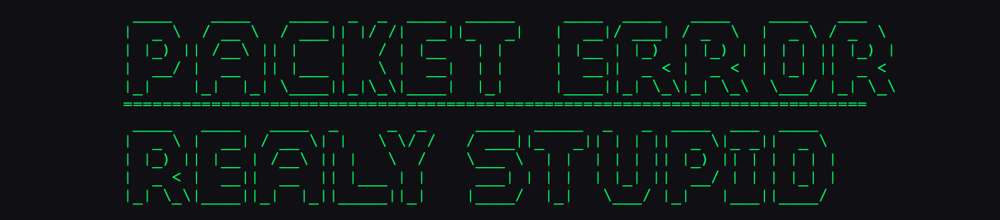

<h1>Packet Error</h1>

$${\color{red}\text{If you want me to join your coole Projekts just ask! :D}}$$
<a href="mailto:packet.error@proton.me">packet.error@proton.me</a>
 
 

An info hub developed with <a href="https://github.com/RealyStupid">@RealyStupid</a>

<a href="https://packeterror-realystupid.github.io/terminalweb/">

  

  

    
  

&nbsp;

  
  &emsp;&emsp;&emsp;
   
   
  
  

&nbsp;

| Skill        | Level    | Notes                                 |
|--------------|----------|---------------------------------------|
| Python       | Learning | Primary language for bot development  |
| css          | Good     | stylesheet language                   |
| "html"       | Good     | markup coding language                |
| Java Script  | Bad      | Still have a lot to learn             |

